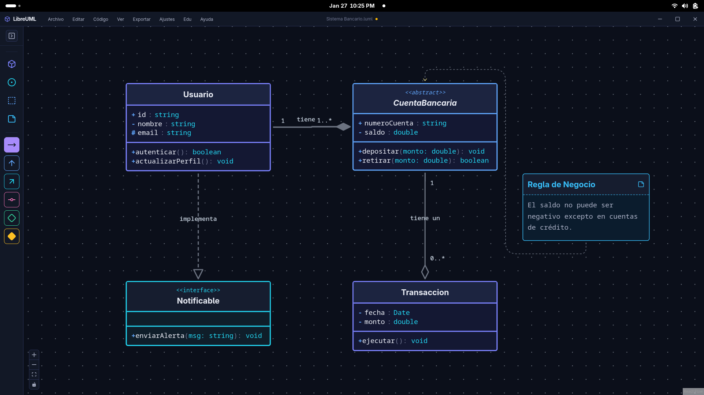
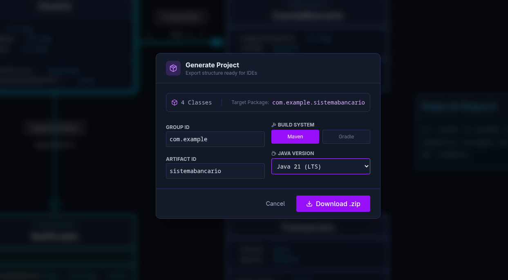
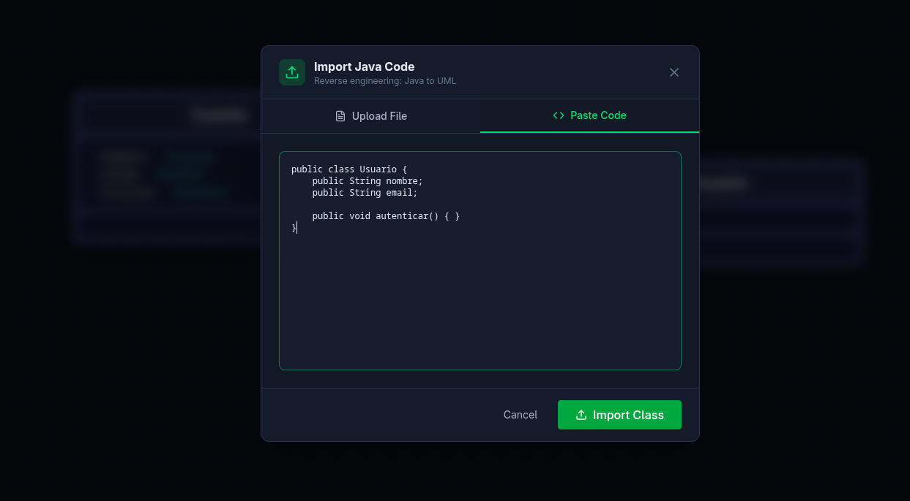

# LibreUML 🚀


**The Open Source, Local-First UML Editor for Students and Developers.**

LibreUML es una herramienta moderna para el modelado de software, diseñada para cerrar la brecha entre el diseño visual y el código real. Sin logins, sin nube, sin complicaciones.



---

## 🌟 ¿Por qué LibreUML?

La mayoría de herramientas UML son costosas, requieren registro o son demasiado complejas para un entorno académico. **LibreUML** nace con una filosofía clara:

* 🔒 **Local-First:** Tus diagramas son archivos (`.luml`). Nada se sube a la nube. Tú posees tus datos.
* ⚡ **Developer Experience:** Interfaz inspirada en VS Code. Atajos de teclado, paleta de comandos y modo oscuro nativo.
* 🔄 **Ciclo Completo:** Dibuja y genera código Java. O importa código Java y genera el diagrama.

---

## ✨ Características Clave

### 1. Ingeniería Directa (Forward Engineering)
Diseña tu diagrama de clases y expórtalo como un proyecto **Java (Maven/Gradle)** listo para compilar.
* Genera estructura de carpetas (`src/main/java...`).
* Crea `pom.xml` o `build.gradle` automáticamente.
* Respeta modificadores de acceso y tipos.



### 2. Ingeniería Inversa (Reverse Engineering)
¿Tienes código legacy? Arrastra tus archivos `.java` y mira cómo LibreUML reconstruye el diagrama.
* Detecta herencia (`extends`) e implementación (`implements`).
* Identifica el Punto de Entrada (`main`) con un indicador visual 🟢.
* Utiliza "Ghost Nodes" para referencias a clases aún no importadas.



### 3. Editor Visual Robusto
* **Drag & Drop:** Interfaz intuitiva con React Flow.
* **Validación:** Previene conexiones ilegales en tiempo real.
* **Internacionalización:** Disponible totalmente en 🇬🇧 Inglés y 🇪🇸 Español.

---

## 🌱 Visión del Proyecto

LibreUML es un proyecto educativo y open source con una visión a largo plazo: 
hacer del **modelado visual una habilidad accesible**, moderna y libre para estudiantes, docentes y personas en formación técnica.

El proyecto explora no solo UML, sino también diagramas de flujo, modelado de bases de datos y otras formas de representación visual como herramientas de pensamiento.

👉 [Leer la Visión de LibreUML](docs/VISION.md)  
👉 [Conocer la proyección educativa: LibreUML Academy](docs/education/ACADEMY_VISION.md)

---

## 🛑 ¿Qué NO es LibreUML?

Para gestionar las expectativas:
* ❌ **No es un SaaS:** No hay base de datos central ni colaboración en tiempo real (por diseño).
* ❌ **No es un LMS:** No califica a los estudiantes (aunque incluye herramientas para que ellos se auto-evalúen).
* ❌ **No es un IDE completo:** Genera la estructura, pero la lógica de negocio se escribe en tu IDE favorito (IntelliJ, Eclipse, VS Code).

---

## 📚 Documentation

- 🌱 [Project Vision](docs/VISION.md)
- 🎓 [LibreUML Academy (Educational Vision)](docs/education/ACADEMY_VISION.md)
- 🎓 [For Educators](docs/education/FOR_EDUCATORS.md)
- 🚀 [Getting Started](docs/onboarding/GETTING_STARTED.md)
- 📐 [UML Standard Compliance](docs/uml/UML_STANDARD.md)
- 🧩 [UI Architecture](UI_ARCHITECTURE.md)


---

## 🛠️ Stack Tecnológico

Proyecto construido con arquitectura moderna y estándares de calidad:

* **Core:** React 18, TypeScript, Vite.
* **Motor Visual:** React Flow.
* **Desktop Wrapper:** Electron (opcional).
* **Estilos:** Tailwind CSS.
* **Testing:** Vitest (Cobertura completa en servicios de parsing y generación). 🟢
* **Architecture:** Hexagonal-ish (Separación estricta de UI, Lógica de Negocio y Stores).

---

## 🚀 Getting Started

### Prerrequisitos
* Node.js 18+

### Instalación

```bash
# 1. Clonar el repositorio
git clone https://github.com/The_Indigo0218/LibreUML.git

# 2. Entrar al directorio
cd LibreUML

# 3. Instalar dependencias
npm install

# 4. Iniciar en modo desarrollo
npm run dev
npm run electron:dev

```

### Ejecutar Tests
Para verificar la integridad del motor de ingeniería:
```bash
npm run test
```

## 🗺️ Roadmap Simplificado

* ✅ **Fase 1: Core** (Editor, Guardado Local, Temas).
* ✅ **Fase 2: Ingeniería** (Java Parser, Zip Generator).
* 🟡 **Fase 3: UX/Polish** (Landing Page, Documentación).
* 🔒 **Fase 4: Multi-lenguaje** (Soporte para Python y SQL).

---

## 📄 Licencia

Este proyecto está bajo la Licencia **MIT** - eres libre de usarlo, modificarlo y distribuirlo, ideal para entornos educativos.

---

<p align="center">
  Hecho con ❤️ para la comunidad de desarrollo.
</p>
